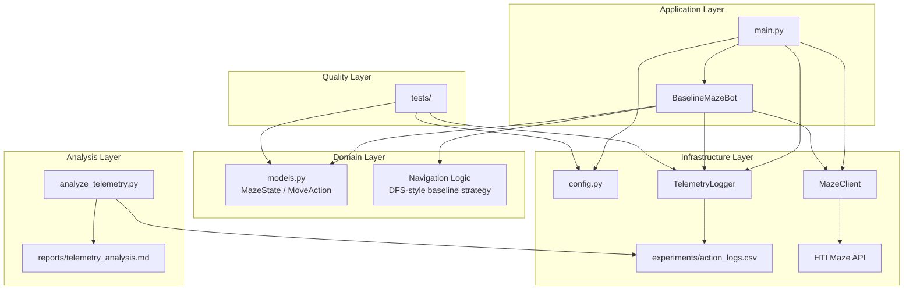

# Adaptive Maze Agent

Data-driven AI/ML maze navigation agent for the HTI technical challenge.

The goal of this project is to build a bot that can navigate mazes, collect rewards and find the exit. The solution is developed step-by-step according to the challenge structure.

## Current Status

### Step 1 — Working Baseline Bot

Implemented.

The current implementation contains a working baseline maze bot based on a simple DFS-like exploration strategy.

The baseline bot can:

- register a player through the Maze API
- list available mazes
- enter a selected maze
- explore the maze using unvisited moves first
- backtrack when no unvisited moves are available
- collect score at score collection points
- remember a known exit
- remember a known score collection point
- return to a collection point before exiting when score is still in hand
- exit the maze successfully

The baseline bot was tested on:

- `Test`
- `Easy deal`

For `Easy deal`, the bot collected the full potential reward:

```text
playerScore: 142
```

This is intentionally still a baseline implementation. The goal of Step 1 is not to create the smartest possible strategy yet, but to create a reliable reference point for later data collection, analysis and comparison.

### Step 2 — Data Collection and Analysis

Implemented.

The baseline bot now writes structured telemetry during navigation. Each decision logs all candidate actions, not only the selected action. This makes it possible to analyze what the bot chose compared to the available alternatives.

The baseline bot was observed on:

- `Example Maze`
- `Gradius Pathways`
- `Hello Maze`

Telemetry is written to:

```text
experiments/action_logs.csv
```

The generated telemetry CSV is ignored by Git because it is runtime data.

The analysis script generates a Markdown report:

```text
reports/telemetry_analysis.md
```

Run the analysis with:

```bash
python -m src.analysis.analyze_telemetry
```

The analysis currently includes:

- overall telemetry summary
- reward distribution
- chosen versus non-chosen candidate actions
- decision type summary
- reward patterns by candidate flags
- reward by current tile branching factor
- initial feature signals based on simple correlations

This step is exploratory. The goal is to understand the collected data before implementing a smarter navigation strategy.

## Why a Baseline First?

A baseline is important because it gives us a fair point of comparison.

Before introducing a data-driven or machine learning based strategy, we first need to understand how a simple deterministic bot performs. Later, the smarter bot can be compared against this baseline using metrics such as:

- final score
- number of steps
- score collected per step
- number of revisits
- percentage of potential reward collected
- whether the exit was found

## Why Telemetry?

The assignment is not only about solving mazes, but also about learning from the data collected during navigation.

For that reason, the bot logs every decision point. It stores both the selected action and the alternative actions that were available at the same moment.

This allows later analysis of questions such as:

- Are rewards uniformly distributed?
- Do certain tile properties correlate with higher rewards?
- Does the baseline bot miss better alternatives?
- Which features could be useful for a smarter policy?

## Architecture

The current implementation follows a lightweight layered architecture. The main idea is to separate orchestration, domain logic, infrastructure concerns and analysis capabilities so the bot can evolve from a simple baseline into a more data-driven AI/ML solution.



### Layer Overview

#### Application Layer

The application layer is responsible for orchestrating the run.

- `main.py` initializes configuration, the API client, the bot and telemetry logging.
- `BaselineMazeBot` controls the maze-solving flow and coordinates exploration, backtracking, score collection and exit handling.

This layer should stay thin and mainly focus on orchestration.

#### Domain Layer

The domain layer contains the maze-related concepts and navigation behavior.

- `models.py` defines the domain models:
  - `MazeState`
  - `MoveAction`
- the baseline navigation logic currently follows a deterministic DFS-like strategy:
  1. prefer unvisited moves
  2. backtrack when necessary
  3. remember important locations such as exits and collection points
  4. collect score before leaving the maze

This layer is the most likely place for future policy abstraction and smarter navigation strategies.

#### Infrastructure Layer

The infrastructure layer handles external interactions and persistence.

- `config.py` loads environment variables and constructs the required authorization header.
- `MazeClient` handles communication with the HTI Maze API:
  - player registration
  - player reset
  - maze listing
  - maze entry
  - movement
  - score collection
  - maze exit
- `TelemetryLogger` writes structured runtime decision data to:
  - `experiments/action_logs.csv`

This separation keeps HTTP details and file I/O out of the navigation logic.

#### Analysis Layer

The analysis layer is responsible for understanding the behavior of the baseline bot.

- `analyze_telemetry.py` reads the telemetry dataset from:
  - `experiments/action_logs.csv`
- it generates an exploratory Markdown report:
  - `reports/telemetry_analysis.md`

This layer is used to identify useful signals before implementing a smarter policy.

#### Quality Layer

The quality layer contains unit tests for the project foundation.

Current test coverage includes:

- configuration and authorization header construction
- API response model parsing
- direction ordering and opposite-direction mapping
- telemetry logging behavior

This helps keep the baseline implementation stable while the project evolves.

### Architectural Intent

This architecture is intentionally designed to support an incremental AI engineering workflow:

1. build a working baseline bot
2. collect structured telemetry
3. analyze runtime behavior
4. introduce a smarter decision policy
5. evaluate improvements against the baseline

By separating application flow, domain logic, infrastructure and analysis, the project remains understandable, testable and easy to extend.

## Setup

Create a conda environment:

```bash
conda create -n adaptive-maze-agent python=3.11 -y
conda activate adaptive-maze-agent
```

Install dependencies:

```bash
pip install -r requirements.txt
```

Create a local `.env` file:

```bash
cp .env.example .env
```

Fill in the API token in `.env`:

```env
MAZE_BASE_URL=https://maze.kluster.htiprojects.nl
MAZE_API_TOKEN=<your-api-token>
PLAYER_NAME=<your-player-name>
DEFAULT_MAZE_NAME=Easy deal
```

The code automatically sends the token using the required authorization header format:

```text
Authorization: HTI Thanks You <token>
```

## Running the Bot

Run the baseline bot:

```bash
python -m src.main
```

You can change the selected maze in `.env`:

```env
DEFAULT_MAZE_NAME=Hello Maze
```

During development, the player can remain inside a maze after an interrupted run. The current runner resets the player state when needed to make local development easier.

## Generating Telemetry

When the bot runs, telemetry is written to:

```text
experiments/action_logs.csv
```

Example command:

```bash
python -m src.main
```

Inspect the first rows:

```bash
head -n 5 experiments/action_logs.csv
```

## Running the Analysis

Generate the telemetry analysis report:

```bash
python -m src.analysis.analyze_telemetry
```

The report is written to:

```text
reports/telemetry_analysis.md
```

## Unit Tests

The project includes unit tests for the current foundation.

The tests cover:

- authorization header formatting
- parsing API move actions into domain models
- parsing maze state responses
- stable baseline direction ordering
- opposite direction mapping
- telemetry CSV logging

Run tests with:

```bash
pytest -v
```

## Current Limitations

This project is currently at Step 2.

The current implementation does not yet:

- train a smarter policy
- compare baseline and smart bot metrics
- use MLflow for experiment tracking
- reconstruct a complete graph-level view of the maze
- precisely classify destination tiles as dead ends, corridors or junctions

The current branching-factor analysis is an approximation. It uses the number of available actions from the current tile, while the immediate reward belongs to the candidate destination tile. A more precise tile-type analysis will require graph reconstruction in a later iteration.

## Next Steps

### Step 3 — Smarter Bot

The next step is to implement a smarter navigation strategy based on the telemetry analysis.

The first smart version should remain simple and explainable. A good first approach is a reward-aware policy that prioritizes:

- unvisited tiles
- higher immediate rewards
- collection points when score is in hand
- lower revisit counts
- exit tiles when the bot is ready to finish

This keeps the strategy interpretable while still making the bot more data-driven than the baseline DFS strategy.

### Step 4 — Evaluation

The final step will compare the baseline bot and the smarter bot in a data-driven way.

Potential evaluation metrics:

- final score
- score per step
- number of steps
- percentage of potential reward collected
- revisit ratio
- whether the exit was found
- number of API calls

### Lightweight MLOps

After the smarter bot is implemented, MLflow can be added as a lightweight MLOps layer.

Potential MLflow tracking:

- bot type
- maze name
- run parameters
- final score
- steps
- score per step
- revisit ratio
- generated telemetry report
- policy/model artifacts

## Design Philosophy

The implementation follows a lightweight AI engineering approach:

1. build a working baseline
2. make the behavior measurable
3. analyze the collected data
4. improve the navigation strategy
5. evaluate improvements against the baseline

The focus is not only on solving the maze, but also on explaining the reasoning, trade-offs and metrics behind the chosen approach.
