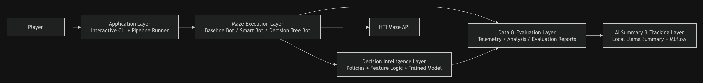

# Adaptive Maze Agent

Data-driven AI/ML maze navigation agent for the HTI technical challenge.

The goal of this project is to build a bot that can navigate mazes, collect rewards and find the exit. The solution is developed step-by-step according to the challenge structure:

1. build a working baseline bot
2. collect and analyze telemetry
3. implement smarter navigation policies
4. evaluate all policies with consistent metrics

The project also includes lightweight local MLflow tracking for training and evaluation metadata, and a local Llama-based evaluation summary.

The application can be used in two ways:

- interactive mode for a guided demo flow
- CLI mode for reproducible commands and automation

---

## Architecture

The current implementation follows a lightweight layered architecture. The main idea is to separate application flow, domain logic, policy decisions, feature engineering, infrastructure, analysis, training, evaluation, AI summarization, tracking and tests.



---

## Layer Overview

### Application Layer

The application layer is responsible for orchestration.

- `main.py` provides both interactive mode and CLI commands.
- `BaselineMazeBot` controls the shared maze-solving flow.
- `SmartMazeBot` reuses the same flow and injects `RewardAwarePolicy`.
- `DecisionTreeMazeBot` reuses the same flow and injects `DecisionTreePolicy`.

The application entry point can:

- show a guided menu
- ask for a player name when missing
- register or switch player
- list available mazes
- play a selected maze with a selected bot
- collect training telemetry
- analyze telemetry
- train the Decision Tree
- evaluate all policies
- generate the AI evaluation summary
- run the full pipeline

---

### Domain and Policy Layer

The domain and policy layer contains maze-related concepts and navigation decision logic.

- `models.py` defines:
  - `MazeState`
  - `MoveAction`
- `NavigationPolicy` defines the contract for decision policies.
- `BaselineDfsPolicy` preserves the deterministic baseline behavior.
- `RewardAwarePolicy` implements the explainable heuristic strategy.
- `DecisionTreePolicy` implements the trained ML-based strategy.

---

### Feature and Training Layer

The feature and training layer converts telemetry into model-ready data.

- `candidate_action_features.py` defines the shared feature schema used during training and inference.
- `train_decision_tree.py` trains a Decision Tree classifier from telemetry.

The training script writes:

```text
models/decision_tree_policy.joblib
reports/decision_tree_policy.txt
reports/decision_tree_policy.png
reports/decision_tree_training_report.md
```

The training report includes:

- telemetry rows before and after filtering
- training policies used
- train/test split size
- accuracy
- confusion matrix
- classification report
- feature importances
- data-driven findings

The Decision Tree model file is treated as a generated artifact and is not normally committed. The reports and graph can be committed because they make model behavior reviewable.

---

### Infrastructure Layer

The infrastructure layer handles external interactions and persistence.

- `config.py` loads environment variables and constructs the authorization header.
- `MazeClient` handles communication with the HTI Maze API:
  - player registration
  - player reset
  - maze listing
  - maze entry
  - movement
  - score collection
  - maze exit
- `TelemetryLogger` writes structured runtime decision data to:
  - `experiments/action_logs.csv`

This separation keeps HTTP details and file I/O out of the navigation logic.

---

### Analysis Layer

The analysis layer is responsible for understanding bot behavior.

- `analyze_telemetry.py` reads telemetry from:

```text
experiments/action_logs.csv
```

- it generates:

```text
reports/telemetry_analysis.md
```

This report helps identify useful signals and compare behavior between policy types.

---

### Evaluation Layer

The evaluation layer compares all implemented policies on the same maze set.

- `evaluate_bots.py` evaluates:
  - `baseline_dfs`
  - `reward_aware`
  - `decision_tree`

It writes:

```text
experiments/evaluation_action_logs.csv
reports/evaluation_results.csv
reports/evaluation_report.md
```

The evaluation report is generated deterministically from metrics.

---

### AI Summary Layer

The AI summary layer adds a readable qualitative interpretation on top of the deterministic evaluation metrics.

- `ai_report_evaluator.py` reads the evaluation results.
- It builds a compact policy summary.
- It checks whether the configured local Llama model exists.
- If needed, it pulls the model through Ollama.
- It asks the local model to generate exactly two short paragraphs.
- It writes the summary to:

```text
reports/evaluation_ai_summary.md
```

- It also appends the summary to:

```text
reports/evaluation_report.md
```

The measured metrics remain the source of truth.

---

### Tracking Layer

The tracking layer provides lightweight local MLflow tracking.

- `mlflow_tracker.py` wraps MLflow usage so training and evaluation can log metadata, metrics and artifacts without coupling the rest of the application to MLflow.
- MLflow can be disabled through `.env`:

```env
ENABLE_MLFLOW=false
```

Local MLflow tracking uses a SQLite backend:

```env
MLFLOW_TRACKING_URI=sqlite:///mlflow.db
```

Local MLflow output can include:

```text
mlflow.db
mlflow.db-shm
mlflow.db-wal
mlruns/
mlartifacts/
```

These generated files and directories are ignored by Git.

---

### Quality Layer

The quality layer contains unit tests.

Current test coverage includes:

- configuration and authorization header construction
- API response model parsing
- direction ordering and opposite-direction mapping
- telemetry CSV logging
- baseline policy behavior
- reward-aware policy behavior
- Decision Tree policy behavior
- candidate-action feature preparation
- Decision Tree training telemetry filtering
- Decision Tree report helper behavior
- evaluation checkpoint metrics
- evaluation report generation
- data-driven evaluation findings
- local Llama summary helper behavior
- MLflow tracking helper behavior

Run tests with:

```bash
pytest -v
```

---

## Setup

Create a conda environment:

```bash
conda create -n adaptive-maze-agent python=3.11 -y
conda activate adaptive-maze-agent
```

Install Python dependencies:

```bash
pip install -r requirements.txt
```

This installs the Python dependencies used by the bot, analysis, training, evaluation and MLflow tracking.

Ollama is not installed through `requirements.txt`. Ollama is a local runtime service and CLI used to run the local Llama model.

---

## Install Ollama CLI

The local Llama summary uses Ollama. Install Ollama for your operating system before running evaluation.

### Windows

Open PowerShell and run:

```powershell
irm https://ollama.com/install.ps1 | iex
```

Verify installation:

```powershell
ollama --version
```

Start and verify the Ollama service:

```powershell
ollama serve
```

### macOS

Download and install Ollama for macOS from the official Ollama download page, then open the Ollama application once. The app verifies that the `ollama` CLI is available in your PATH and can create the CLI link when needed.

Alternatively, install Ollama through Homebrew:

```bash
brew install ollama
```

Verify installation:

```bash
ollama --version
```

Start and verify the Ollama service:

```bash
ollama serve
```

### Linux

Run:

```bash
curl -fsSL https://ollama.com/install.sh | sh
```

Verify installation:

```bash
ollama --version
```

Start and verify the Ollama service:

```bash
ollama serve
```

### Model Pulling

The app can pull the configured model automatically during evaluation when:

```env
LLAMA_AUTO_PULL_MODEL=true
```

You can also pull the model manually:

```bash
ollama pull llama3.2:1b
```

---

## Environment Configuration

Create a local `.env` file:

```bash
cp .env.example .env
```

Fill in the API token in `.env`:

```env
# Maze API configuration
MAZE_BASE_URL=https://maze.kluster.htiprojects.nl
MAZE_API_TOKEN=<your-api-token>

# Player configuration
# Optional for interactive mode. If omitted or left empty, the app will ask for a player name.
PLAYER_NAME=

# Default single-run configuration
DEFAULT_MAZE_NAME=Easy deal

# Supported values: baseline, smart, decision_tree
BOT_TYPE=baseline

# Set to true during local development if the player can remain inside a maze
# after an interrupted run.
RESET_PLAYER_ON_START=false

# Lightweight MLflow tracking
ENABLE_MLFLOW=true
MLFLOW_TRACKING_URI=sqlite:///mlflow.db
MLFLOW_EXPERIMENT_NAME=adaptive-maze-agent

# Local Llama evaluation summary
ENABLE_LLAMA_EVALUATION=true
LLAMA_AUTO_PULL_MODEL=true
LLAMA_EVALUATION_BASE_URL=http://localhost:11434/v1
LLAMA_EVALUATION_API_KEY=ollama
LLAMA_EVALUATION_MODEL=llama3.2:1b
LLAMA_EVALUATION_TIMEOUT_SECONDS=60
LLAMA_MODEL_PULL_TIMEOUT_SECONDS=600
```

The code automatically sends the token using the required authorization header format:

```text
Authorization: HTI Thanks You <token>
```

---

## Running the Application

### Interactive Mode

Run the application without arguments:

```bash
python -m src.main
```

Interactive mode shows:

- current known player name
- register or switch player
- available mazes
- play new game
- collect training telemetry
- analyze telemetry
- train Decision Tree
- evaluate all policies
- run the full pipeline
- report paths

Example menu:

```text
Main menu

Current player: Adaptive Maze Player

1. Play new game
2. Run entire pipeline with default settings
3. Register or switch player
4. List available mazes
5. Collect training telemetry
6. Analyze telemetry
7. Train Decision Tree
8. Evaluate all policies
9. Run full pipeline with custom training mazes
10. Show guide
11. Show generated report paths
0. Exit
```

---

### CLI Mode

List available mazes:

```bash
python -m src.main list-mazes
```

Run one bot on one maze:

```bash
python -m src.main run-bot \
  --bot-type baseline \
  --maze-name "Example Maze" \
  --reset-player
```

Collect training telemetry from baseline and reward-aware bots:

```bash
python -m src.main collect-training-data --fresh-telemetry
```

Analyze telemetry:

```bash
python -m src.main analyze-telemetry
```

Train the Decision Tree policy:

```bash
python -m src.main train-decision-tree
```

Evaluate all policies and generate the local Llama summary:

```bash
python -m src.main evaluate
```

Run the full default pipeline:

```bash
python -m src.main pipeline --fresh-telemetry
```

---

## Recommended Workflow

For a clean end-to-end run:

```bash
python -m src.main pipeline --fresh-telemetry
```

This performs:

1. collect training telemetry from `baseline` and `smart`
2. generate telemetry analysis
3. train the Decision Tree policy
4. evaluate all policies
5. generate Markdown reports
6. generate the AI evaluation summary
7. log training and evaluation metadata to MLflow when enabled

The default training mazes are:

```text
Example Maze
Gradius Pathways
Hello Maze
```

The evaluation workflow includes seen and unseen mazes.

---

## Running Individual Bots

### Baseline Bot

```bash
python -m src.main run-bot \
  --bot-type baseline \
  --maze-name "Example Maze" \
  --reset-player
```

The telemetry should contain:

```text
bot_name: baseline_dfs
```

---

### Reward-Aware Smart Bot

```bash
python -m src.main run-bot \
  --bot-type smart \
  --maze-name "Example Maze" \
  --reset-player
```

The telemetry should contain:

```text
bot_name: reward_aware
```

---

### Decision Tree Bot

Train the model first:

```bash
python -m src.main train-decision-tree
```

Then run:

```bash
python -m src.main run-bot \
  --bot-type decision_tree \
  --maze-name "Example Maze" \
  --reset-player
```

The telemetry should contain:

```text
bot_name: decision_tree
```

---

## Training the Decision Tree Policy

Before training, collect telemetry from baseline and reward-aware policies:

```bash
python -m src.main collect-training-data --fresh-telemetry
```

Then train:

```bash
python -m src.main train-decision-tree
```

This generates:

```text
models/decision_tree_policy.joblib
reports/decision_tree_policy.txt
reports/decision_tree_policy.png
reports/decision_tree_training_report.md
```

Open the Decision Tree graph locally:

```bash
open reports/decision_tree_policy.png
```

The training script filters telemetry before training.

Used for training:

```text
baseline_dfs
reward_aware
```

Excluded from training:

```text
decision_tree
```

This prevents training the Decision Tree on its own generated behavior.

When MLflow is enabled, training also logs:

- model parameters
- training row counts
- train/test split size
- accuracy
- feature importances
- generated training artifacts

---

## Running the Evaluation

Run:

```bash
python -m src.main evaluate
```

This generates:

```text
experiments/evaluation_action_logs.csv
reports/evaluation_results.csv
reports/evaluation_report.md
reports/evaluation_ai_summary.md
```

The evaluation report includes deterministic data-driven findings such as:

- final score finding
- best score per step
- early reward progress leaders
- first collection step leaders
- first exit-capable tile step leaders
- backtrack ratio leaders
- exit success rate leaders

The AI summary is appended as a separate section at the end of the report.

When MLflow is enabled, evaluation also logs:

- evaluated policies
- evaluated mazes
- average score by policy
- score per step by policy
- exit success rate
- generated evaluation artifacts
- AI evaluation summary artifact

---

## AI Evaluation Summary

The AI summary is generated during evaluation.

It reads only structured evaluation output and generates a two-paragraph summary for reviewers. The measured metrics remain the source of truth.

Configuration:

```env
ENABLE_LLAMA_EVALUATION=true
LLAMA_AUTO_PULL_MODEL=true
LLAMA_EVALUATION_BASE_URL=http://localhost:11434/v1
LLAMA_EVALUATION_API_KEY=ollama
LLAMA_EVALUATION_MODEL=llama3.2:1b
LLAMA_EVALUATION_TIMEOUT_SECONDS=60
LLAMA_MODEL_PULL_TIMEOUT_SECONDS=600
```

Output:

```text
reports/evaluation_ai_summary.md
```

The same summary is appended to:

```text
reports/evaluation_report.md
```

Disable the Llama summary if needed:

```env
ENABLE_LLAMA_EVALUATION=false
```

---

## Lightweight MLflow Tracking

MLflow tracking is local by default.

It is configured in `.env`:

```env
ENABLE_MLFLOW=true
MLFLOW_TRACKING_URI=sqlite:///mlflow.db
MLFLOW_EXPERIMENT_NAME=adaptive-maze-agent
```

Disable tracking:

```env
ENABLE_MLFLOW=false
```

Run training and evaluation:

```bash
python -m src.main train-decision-tree
python -m src.main evaluate
```

or run the full pipeline:

```bash
python -m src.main pipeline --fresh-telemetry
```

Start the local MLflow UI:

```bash
mlflow ui --backend-store-uri sqlite:///mlflow.db
```

Then open the local MLflow UI in the browser.

MLflow is used only for lightweight local tracking. The Markdown reports remain the main reviewable output of the project.

---

## Generated Artifacts

The project produces several generated artifacts.

Runtime telemetry:

```text
experiments/action_logs.csv
```

Evaluation telemetry:

```text
experiments/evaluation_action_logs.csv
```

Telemetry analysis:

```text
reports/telemetry_analysis.md
```

Decision Tree model:

```text
models/decision_tree_policy.joblib
```

Decision Tree explanation artifacts:

```text
reports/decision_tree_policy.txt
reports/decision_tree_policy.png
reports/decision_tree_training_report.md
```

Evaluation artifacts:

```text
reports/evaluation_results.csv
reports/evaluation_report.md
reports/evaluation_ai_summary.md
```

MLflow local tracking database and artifacts:

```text
mlflow.db
mlflow.db-shm
mlflow.db-wal
mlruns/
mlartifacts/
```

Runtime telemetry CSV files, local MLflow files and trained model files are generated artifacts and should not normally be committed.

The Markdown reports, evaluation CSV and Decision Tree graph can be committed because they make the analysis, evaluation and model behavior reviewable.

---

## Unit Tests

Run all tests:

```bash
pytest -v
```

Run specific test groups:

```bash
pytest -v tests/test_decision_tree_training.py
pytest -v tests/test_evaluation_report.py
pytest -v tests/test_ai_report_evaluator.py
```

The tests cover:

- configuration loading
- authorization header formatting
- API response model parsing
- telemetry logging
- policy behavior
- feature preparation
- Decision Tree inference
- training telemetry filtering
- training report helpers
- evaluation metrics
- evaluation report generation
- data-driven evaluation findings
- local Llama summary helper behavior
- MLflow tracking helper behavior

---

## Current Status

### Step 1 — Working Baseline Bot

Implemented.

The project contains a working baseline maze bot based on a deterministic DFS-like exploration strategy.

DFS, or Depth-First Search, explores as far as possible along each branch before backtracking. The bot keeps track of the path, moves to unvisited destination tiles first and backtracks when no unvisited moves are available.

The baseline bot can:

- register a player through the Maze API
- list available mazes
- enter a selected maze
- explore the maze using unvisited moves first
- backtrack when no unvisited moves are available
- collect score at score collection points
- remember a known exit
- remember a known score collection point
- return to a collection point before exiting when score is still in hand
- exit the maze successfully

The baseline bot was tested on:

- `Test`
- `Easy deal`
- `Hello Maze`

For `Easy deal`, the bot collected the full potential reward:

```text
playerScore: 142
```

This baseline is intentionally simple. It provides a stable reference point for later telemetry collection, smarter policies and evaluation.

---

### Step 2 — Data Collection and Analysis

Implemented.

The bot writes structured telemetry during navigation. Each decision logs all candidate actions, not only the selected action. This makes it possible to analyze what the bot chose compared with the alternatives that were available at the same decision point.

Telemetry is written to:

```text
experiments/action_logs.csv
```

The generated telemetry CSV is ignored by Git because it is runtime data.

The analysis script generates a Markdown report:

```text
reports/telemetry_analysis.md
```

Run the analysis with:

```bash
python -m src.main analyze-telemetry
```

or directly:

```bash
python -m src.analysis.analyze_telemetry
```

The telemetry analysis includes:

- overall telemetry summary
- runs by bot policy and maze
- reward distribution
- policy reward comparison
- chosen versus non-chosen candidate actions
- decision type summary
- reward patterns by candidate flags
- reward by current tile branching factor
- initial feature signals based on simple correlations
- feature signals by bot policy

This step is exploratory. The goal is to understand the collected data before and after implementing smarter navigation strategies.

---

### Step 3 — Smart Bot Policies

Implemented.

The project includes smarter bot implementations based on a policy abstraction.

Instead of hardcoding all navigation logic directly inside the bot orchestration, navigation decisions are delegated to a separate policy layer. This keeps the solution modular and makes it possible to compare different navigation strategies fairly.

Implemented policies:

- `BaselineDfsPolicy`
- `RewardAwarePolicy`
- `DecisionTreePolicy`

The baseline policy preserves the original deterministic DFS-like behavior.

The reward-aware policy is an explainable heuristic strategy. It scores candidate actions using simple, transparent features:

- whether the destination tile is unvisited
- immediate reward on the destination tile
- whether the destination allows score collection
- whether the destination allows exit
- destination revisit count
- whether the destination is the start tile

The Decision Tree policy is a lightweight trained ML strategy. It is trained from telemetry data using candidate-action features and a weakly supervised target. For each decision point, the candidate action with the highest transparent preference score is marked as the preferred action.

The smart bot implementations are:

- `SmartMazeBot`, using `RewardAwarePolicy`
- `DecisionTreeMazeBot`, using `DecisionTreePolicy`

Both reuse the same robust maze orchestration as the baseline bot. Only the decision policy changes.

This makes the smart bot layer:

- explainable
- easy to test
- easy to compare against the baseline
- extensible for future policy learning
- aligned with a data-driven AI engineering workflow

---

### Step 4 — Policy Evaluation

Implemented.

The project includes an evaluation workflow that compares all implemented policies on the same maze set.

Evaluated policies:

- `baseline_dfs`
- `reward_aware`
- `decision_tree`

Evaluation output is written to:

```text
reports/evaluation_results.csv
reports/evaluation_report.md
```

Evaluation telemetry is written separately to:

```text
experiments/evaluation_action_logs.csv
```

The evaluation report is generated deterministically from the evaluation results. It calculates findings from the metrics.

The evaluation includes:

- final score
- score per step
- number of logged decision steps
- average chosen reward
- forward-exploration reward
- revisit ratio
- forward-exploration revisit ratio
- backtracking ratio
- first exit-capable tile step
- first collection point step
- early reward progress checkpoints
- exit success rate

This is important because all bots reuse a full-exploration orchestration. On simple mazes, final score can be identical across policies because all policies eventually visit the same reachable reward tiles and exit. In that case, order-sensitive metrics such as early reward progress and first collection step are more informative than final score alone.

Run evaluation with:

```bash
python -m src.main evaluate
```

or directly:

```bash
python -m src.evaluation.evaluate_bots
```

---

### AI Evaluation Summary

Implemented.

The evaluation workflow includes a local Llama-based report summarizer.

The summarizer reads the structured evaluation results from:

```text
reports/evaluation_results.csv
```

and generates a short two-paragraph qualitative summary. The deterministic metrics remain the source of truth; the Llama summary is used only as a readable interpretation layer on top of the measured results.

The generated summary is written to:

```text
reports/evaluation_ai_summary.md
```

and appended to:

```text
reports/evaluation_report.md
```

The project is configured to use a small local Llama model through Ollama:

```env
ENABLE_LLAMA_EVALUATION=true
LLAMA_AUTO_PULL_MODEL=true
LLAMA_EVALUATION_BASE_URL=http://localhost:11434/v1
LLAMA_EVALUATION_API_KEY=ollama
LLAMA_EVALUATION_MODEL=llama3.2:1b
LLAMA_EVALUATION_TIMEOUT_SECONDS=60
LLAMA_MODEL_PULL_TIMEOUT_SECONDS=600
```

When evaluation runs, the application checks whether the configured local Llama model is available. If the model is missing and `LLAMA_AUTO_PULL_MODEL=true`, the app pulls the model automatically with Ollama before generating the summary.

Run evaluation with:

```bash
python -m src.main evaluate
```

---

### Lightweight MLflow Tracking

Implemented.

The project includes lightweight local MLflow tracking.

MLflow is used only to track training and evaluation metadata. It does not change the bot logic, does not replace the Markdown reports and does not introduce a deployment or model registry workflow.

Tracked training data includes:

- Decision Tree parameters
- telemetry rows before and after filtering
- training row counts
- train/test split size
- accuracy
- feature importances
- generated Decision Tree artifacts

Tracked evaluation data includes:

- evaluated policies
- evaluated mazes
- average score by policy
- score per step by policy
- exit success rate
- generated evaluation artifacts
- AI evaluation summary artifact

MLflow tracking is configured through `.env`:

```env
ENABLE_MLFLOW=true
MLFLOW_TRACKING_URI=sqlite:///mlflow.db
MLFLOW_EXPERIMENT_NAME=adaptive-maze-agent
```

Run MLflow UI locally with:

```bash
mlflow ui --backend-store-uri sqlite:///mlflow.db
```

Then open the local MLflow UI in the browser.

If MLflow cannot be configured, the main training and evaluation pipeline continues and prints a warning instead of failing.

Disable MLflow tracking with:

```env
ENABLE_MLFLOW=false
```

---

## Why a Baseline First?

A baseline gives a fair reference point.

Before introducing a data-driven or machine-learning-based strategy, the project first establishes how a simple deterministic bot performs. Later, smarter policies can be compared against that baseline using consistent metrics such as:

- final score
- score per step
- number of steps
- average chosen reward
- number of revisits
- backtracking ratio
- whether the exit was found

---

## Why Telemetry?

The challenge is not only about solving mazes, but also about learning from the data collected during navigation.

The telemetry logger records every decision point. It stores both the selected action and the alternative candidate actions that were available at the same moment.

This enables analysis of questions such as:

- Are rewards uniformly distributed?
- Do certain tile properties correlate with higher rewards?
- Does the baseline bot miss better alternatives?
- Which features could be useful for a smarter policy?
- Can a lightweight ML model learn useful move preferences from telemetry?
- Do smarter policies find useful rewards earlier than the baseline?

---

## Why a Policy-Based Design?

A policy-based design separates the question:

```text
How do we choose the next move?
```

from the rest of the maze-solving flow.

The bot orchestration remains stable while different decision strategies can be tested independently.

For example:

- `BaselineDfsPolicy` is the reference strategy
- `RewardAwarePolicy` is the first explainable smart strategy
- `DecisionTreePolicy` is the lightweight trained ML strategy

This design supports incremental development, testing and evaluation.

---

## Why a Decision Tree?

A Decision Tree is a good fit for this challenge because the Maze API exposes structured candidate-action features.

The Decision Tree approach provides:

- a trained ML policy
- deterministic inference
- explainable decision rules
- feature importance
- a visual tree artifact for discussion
- a lightweight implementation that avoids overengineering

The goal is not to build a complex black-box model. The goal is to show how telemetry can be converted into a simple supervised learning problem and then used for navigation decisions.

Decision Tree training intentionally excludes telemetry generated by the Decision Tree policy itself. This prevents the model from training on its own later behavior.

Training data is limited to:

```text
baseline_dfs
reward_aware
```

Excluded from training:

```text
decision_tree
```

---

## Current Limitations

The current solution is intentionally lightweight.

Known limitations:

- The shared bot orchestration performs full exploration before exiting. This can make final score identical across policies on simple mazes.
- The current evaluation therefore relies on order-sensitive metrics as well as final score.
- The project does not reconstruct a complete graph-level representation of the maze.
- The branching-factor analysis is approximate. It uses the number of available actions from the current tile, while the immediate reward belongs to the candidate destination tile.
- The project does not precisely classify destination tiles as dead ends, corridors or junctions.
- The Decision Tree target is weakly supervised from a transparent preference score, not from human labels or final maze outcomes.
- The project does not train a reinforcement learning policy.
- The local Llama summary is a reporting aid and not part of the scoring logic.
- The project does not use a large-scale ML model. The Decision Tree is intentionally lightweight and explainable.
- MLflow tracking is intentionally local and lightweight. It is not used as a deployment, model registry or production MLOps system.

These limitations are deliberate trade-offs for a 4–8 hour technical challenge. The implementation focuses on correctness, explainability, telemetry, model simplicity, reproducible evaluation, local LLM summarization and lightweight experiment tracking.
