# Adaptive Maze Agent

Data-driven AI/ML maze navigation agent for the HTI technical challenge.

The goal of this project is to build a bot that can navigate mazes, collect rewards and find the exit. The solution is developed step-by-step according to the challenge structure.

## Current Status

### Step 1 — Working Baseline Bot

Implemented.

The current implementation contains a working baseline maze bot based on a simple DFS-like exploration strategy.

DFS (Depth-First Search) is a graph traversal algorithm that explores as far as possible along each branch before backtracking. It uses a stack to keep track of the path, visiting unvisited neighbors and returning to previous nodes when no unvisited neighbors remain.

The baseline bot can:

- register a player through the Maze API
- list available mazes
- enter a selected maze
- explore the maze using unvisited moves first
- backtrack when no unvisited moves are available
- collect score at score collection points
- remember a known exit
- remember a known score collection point
- return to a collection point before exiting when score is still in hand
- exit the maze successfully

The baseline bot was tested on:

- `Test`
- `Easy deal`
- `Hello Maze`

For `Easy deal`, the bot collected the full potential reward:

```text
playerScore: 142
```

This is intentionally still a baseline implementation. The goal of Step 1 is not to create the smartest possible strategy yet, but to create a reliable reference point for later data collection, analysis and comparison.

### Step 2 — Data Collection and Analysis

Implemented.

The baseline bot now writes structured telemetry during navigation. Each decision logs all candidate actions, not only the selected action. This makes it possible to analyze what the bot chose compared to the available alternatives.

The baseline bot was observed on:

- `Example Maze`
- `Gradius Pathways`
- `Hello Maze`

Telemetry is written to:

```text
experiments/action_logs.csv
```

The generated telemetry CSV is ignored by Git because it is runtime data.

The analysis script generates a Markdown report:

```text
reports/telemetry_analysis.md
```

Run the analysis with:

```bash
python -m src.analysis.analyze_telemetry
```

The analysis currently includes:

- overall telemetry summary
- runs by bot policy and maze
- reward distribution
- policy reward comparison
- chosen versus non-chosen candidate actions
- decision type summary
- reward patterns by candidate flags
- reward by current tile branching factor
- initial feature signals based on simple correlations
- feature signals by bot policy

This step is exploratory. The goal is to understand the collected data before implementing and evaluating smarter navigation strategies.

### Step 3 — Smart Bot

Implemented.

The project now includes smarter bot implementations based on a policy abstraction.

Instead of hardcoding smart logic directly inside the bot orchestration, navigation decisions are delegated to a separate policy layer. This keeps the solution modular and makes it possible to compare different navigation strategies fairly.

Implemented policies:

- `BaselineDfsPolicy`
- `RewardAwarePolicy`
- `DecisionTreePolicy`

The baseline policy preserves the original deterministic DFS-like behavior.

The reward-aware policy is the first smart strategy. It scores candidate actions using simple, explainable features:

- whether the destination tile is unvisited
- immediate reward on the destination tile
- whether the destination allows score collection
- whether the destination allows exit
- destination revisit count
- whether the destination is the start tile

The Decision Tree policy is the first trained ML-based strategy. It is trained from telemetry data using candidate-action features and a weakly supervised target. For each decision point, the candidate action with the highest transparent preference score is marked as the preferred action.

The smart bot implementations are:

- `SmartMazeBot`, using `RewardAwarePolicy`
- `DecisionTreeMazeBot`, using `DecisionTreePolicy`

Both reuse the same robust maze orchestration as the baseline bot. Only the decision policy changes.

This makes the smart bot layer:

- explainable
- easy to test
- easy to compare against the baseline
- extensible for future ML-based policy learning
- aligned with a data-driven AI engineering workflow

The selected bot can be configured through `.env`:

```env
BOT_TYPE=baseline
```

or:

```env
BOT_TYPE=smart
```

or:

```env
BOT_TYPE=decision_tree
```

## Why a Baseline First?

A baseline is important because it gives us a fair point of comparison.

Before introducing a data-driven or machine learning based strategy, we first need to understand how a simple deterministic bot performs. Later, smarter bots can be compared against this baseline using metrics such as:

- final score
- number of steps
- score collected per step
- number of revisits
- percentage of potential reward collected
- whether the exit was found

## Why Telemetry?

The assignment is not only about solving mazes, but also about learning from the data collected during navigation.

For that reason, the bot logs every decision point. It stores both the selected action and the alternative actions that were available at the same moment.

This allows later analysis of questions such as:

- Are rewards uniformly distributed?
- Do certain tile properties correlate with higher rewards?
- Does the baseline bot miss better alternatives?
- Which features could be useful for a smarter policy?
- Can a lightweight ML model learn useful move preferences from telemetry?

## Why a Policy-Based Smart Bot?

A policy-based design separates the question "how do we choose the next move?" from the rest of the maze-solving flow.

This is useful because the bot orchestration remains stable while different decision strategies can be tested independently.

For example:

- `BaselineDfsPolicy` can be used as the reference strategy
- `RewardAwarePolicy` can be used as the first explainable smart strategy
- `DecisionTreePolicy` can be used as a lightweight trained ML strategy
- a future reinforcement learning or model-based policy could be added without rewriting the bot

This design supports the AI engineering workflow of comparing strategies, measuring behavior and improving the decision layer incrementally.

## Why a Decision Tree?

A Decision Tree is a good fit for this challenge because the API exposes structured candidate-action features, not natural language.

The Decision Tree approach gives us:

- an actual trained ML policy
- deterministic inference
- explainable decision rules
- feature importance
- a visual tree artifact for discussion
- a lightweight implementation that avoids overengineering

The goal is not to build a complex black-box model. The goal is to show how telemetry can be converted into a simple supervised learning problem and then used to make navigation decisions.

## Architecture

The current implementation follows a lightweight layered architecture. The main idea is to separate orchestration, domain logic, decision policies, feature engineering, infrastructure concerns, model training and analysis capabilities so the bot can evolve from a simple baseline into a more data-driven AI/ML solution.

```mermaid
flowchart TD
    %% Application Layer
    subgraph APP[Application Layer]
        A[main.py]
        B[BaselineMazeBot]
        C[SmartMazeBot]
        D[DecisionTreeMazeBot]
    end

    %% Domain and Policy Layer
    subgraph DOMAIN[Domain and Policy Layer]
        E[models.py<br/>MazeState / MoveAction]
        F[NavigationPolicy]
        G[BaselineDfsPolicy]
        H[RewardAwarePolicy]
        I[DecisionTreePolicy]
    end

    %% Feature and Training Layer
    subgraph ML[Feature and Training Layer]
        J[candidate_action_features.py]
        K[train_decision_tree.py]
        L[models/decision_tree_policy.joblib]
        M[reports/decision_tree_policy.png]
        N[reports/decision_tree_policy.txt]
        O[reports/decision_tree_training_report.md]
    end

    %% Infrastructure Layer
    subgraph INFRA[Infrastructure Layer]
        P[config.py]
        Q[MazeClient]
        R[TelemetryLogger]
        S[experiments/action_logs.csv]
        T[HTI Maze API]
    end

    %% Analysis Layer
    subgraph ANALYSIS[Analysis Layer]
        U[analyze_telemetry.py]
        V[reports/telemetry_analysis.md]
    end

    %% Quality Layer
    subgraph TESTS[Quality Layer]
        W[tests/]
    end

    A --> P
    A --> Q
    A --> B
    A --> C
    A --> D
    A --> R

    B --> F
    C --> F
    D --> F

    F --> G
    F --> H
    F --> I

    B --> E
    C --> E
    D --> E

    B --> Q
    C --> Q
    D --> Q

    B --> R
    C --> R
    D --> R

    I --> L
    I --> J

    K --> S
    K --> J
    K --> L
    K --> M
    K --> N
    K --> O

    Q --> T
    R --> S

    U --> S
    U --> V

    W --> P
    W --> E
    W --> R
    W --> G
    W --> H
    W --> I
    W --> J
```



### Layer Overview

#### Application Layer

The application layer is responsible for orchestrating the run.

- `main.py` initializes configuration, the API client, the selected bot and telemetry logging.
- `BaselineMazeBot` controls the maze-solving flow and coordinates exploration, backtracking, score collection and exit handling.
- `SmartMazeBot` reuses the same orchestration but injects a smarter reward-aware policy.
- `DecisionTreeMazeBot` reuses the same orchestration but injects a trained Decision Tree policy.

This layer should stay thin and mainly focus on orchestration.

#### Domain and Policy Layer

The domain and policy layer contains the maze-related concepts and navigation decision logic.

- `models.py` defines the domain models:
  - `MazeState`
  - `MoveAction`
- `NavigationPolicy` defines the contract for decision policies.
- `BaselineDfsPolicy` preserves the deterministic baseline behavior.
- `RewardAwarePolicy` implements the first smarter navigation strategy.
- `DecisionTreePolicy` implements a trained ML-based navigation strategy.

The reward-aware policy uses an explainable scoring function instead of a black-box model. The Decision Tree policy then turns the telemetry into a lightweight supervised ML model.

#### Feature and Training Layer

The feature and training layer converts telemetry into model-ready data.

- `candidate_action_features.py` defines the shared feature schema used during both training and inference.
- `train_decision_tree.py` trains a Decision Tree classifier from telemetry.
- The trained model is written to:

```text
models/decision_tree_policy.joblib
```

- A text representation of the tree is written to:

```text
reports/decision_tree_policy.txt
```

- A visual Decision Tree graph is written to:

```text
reports/decision_tree_policy.png
```

- A training summary is written to:

```text
reports/decision_tree_training_report.md
```

The model file is treated as a generated artifact and is not committed by default. The reports and graph can be committed to make the model behavior reviewable.

#### Infrastructure Layer

The infrastructure layer handles external interactions and persistence.

- `config.py` loads environment variables and constructs the required authorization header.
- `MazeClient` handles communication with the HTI Maze API:
  - player registration
  - player reset
  - maze listing
  - maze entry
  - movement
  - score collection
  - maze exit
- `TelemetryLogger` writes structured runtime decision data to:
  - `experiments/action_logs.csv`

This separation keeps HTTP details and file I/O out of the navigation logic.

#### Analysis Layer

The analysis layer is responsible for understanding the behavior of the bot.

- `analyze_telemetry.py` reads the telemetry dataset from:
  - `experiments/action_logs.csv`
- it generates an exploratory Markdown report:
  - `reports/telemetry_analysis.md`

This layer is used to identify useful signals and support future evaluation between the baseline, reward-aware and Decision Tree policies.

#### Quality Layer

The quality layer contains unit tests for the project foundation.

Current test coverage includes:

- configuration and authorization header construction
- API response model parsing
- direction ordering and opposite-direction mapping
- telemetry logging behavior
- baseline policy decision behavior
- reward-aware policy decision behavior
- Decision Tree policy behavior
- candidate-action feature preparation

This helps keep the implementation stable while the project evolves.

### Architectural Intent

This architecture is intentionally designed to support an incremental AI engineering workflow:

1. build a working baseline bot
2. collect structured telemetry
3. analyze runtime behavior
4. introduce an explainable smart policy
5. train a lightweight ML policy
6. evaluate improvements against the baseline

By separating application flow, domain logic, policy decisions, feature engineering, infrastructure and analysis, the project remains understandable, testable and easy to extend.

## Setup

Create a conda environment:

```bash
conda create -n adaptive-maze-agent python=3.11 -y
conda activate adaptive-maze-agent
```

Install dependencies:

```bash
pip install -r requirements.txt
```

Create a local `.env` file:

```bash
cp .env.example .env
```

Fill in the API token in `.env`:

```env
MAZE_BASE_URL=https://maze.kluster.htiprojects.nl
MAZE_API_TOKEN=<your-api-token>
PLAYER_NAME=<your-player-name>
DEFAULT_MAZE_NAME=Easy deal
BOT_TYPE=baseline
RESET_PLAYER_ON_START=false
```

The code automatically sends the token using the required authorization header format:

```text
Authorization: HTI Thanks You <token>
```

## Running the Bot

Run the selected bot:

```bash
python -m src.main
```

You can change the selected maze in `.env`:

```env
DEFAULT_MAZE_NAME=Hello Maze
```

You can select the bot type in `.env`:

```env
BOT_TYPE=baseline
```

or:

```env
BOT_TYPE=smart
```

or:

```env
BOT_TYPE=decision_tree
```

During development, the player can remain inside a maze after an interrupted run. The runner can reset the player state when needed to make local development and comparison easier:

```env
RESET_PLAYER_ON_START=true
```

## Running the Reward-Aware Smart Bot

To run the reward-aware smart bot locally, update `.env`:

```env
DEFAULT_MAZE_NAME=Example Maze
BOT_TYPE=smart
RESET_PLAYER_ON_START=true
```

Then run:

```bash
python -m src.main
```

Generate the updated telemetry analysis:

```bash
python -m src.analysis.analyze_telemetry
```

The telemetry should include rows where:

```text
bot_name: reward_aware
```

## Training the Decision Tree Bot

Before running the Decision Tree bot, collect telemetry from baseline and reward-aware runs.

Then train the model:

```bash
python -m src.training.train_decision_tree
```

This generates:

```text
models/decision_tree_policy.joblib
reports/decision_tree_policy.txt
reports/decision_tree_policy.png
reports/decision_tree_training_report.md
```

The visual tree can be opened locally:

```bash
open reports/decision_tree_policy.png
```

The Decision Tree graph is useful during the technical interview because it shows which candidate-action features the model used to make decisions.

## Running the Decision Tree Bot

After training the model, update `.env`:

```env
DEFAULT_MAZE_NAME=Example Maze
BOT_TYPE=decision_tree
RESET_PLAYER_ON_START=true
```

Then run:

```bash
python -m src.main
```

Generate the updated telemetry analysis:

```bash
python -m src.analysis.analyze_telemetry
```

The telemetry should include rows where:

```text
bot_name: decision_tree
```

## Generating Telemetry

When the bot runs, telemetry is written to:

```text
experiments/action_logs.csv
```

Example command:

```bash
python -m src.main
```

Inspect the first rows:

```bash
head -n 5 experiments/action_logs.csv
```

Inspect the latest rows:

```bash
tail -n 10 experiments/action_logs.csv
```

## Running the Analysis

Generate the telemetry analysis report:

```bash
python -m src.analysis.analyze_telemetry
```

The report is written to:

```text
reports/telemetry_analysis.md
```

## Generated Artifacts

The project produces several generated artifacts during local runs.

Runtime telemetry:

```text
experiments/action_logs.csv
```

Telemetry analysis:

```text
reports/telemetry_analysis.md
```

Decision Tree model:

```text
models/decision_tree_policy.joblib
```

Decision Tree explanation artifacts:

```text
reports/decision_tree_policy.txt
reports/decision_tree_policy.png
reports/decision_tree_training_report.md
```

The runtime telemetry CSV and trained model file are generated artifacts and should not normally be committed. The Markdown reports and Decision Tree graph can be committed because they make the analysis and model behavior reviewable.

## Unit Tests

The project includes unit tests for the current foundation.

The tests cover:

- authorization header formatting
- parsing API move actions into domain models
- parsing maze state responses
- stable baseline direction ordering
- opposite direction mapping
- telemetry CSV logging
- baseline DFS policy behavior
- reward-aware policy behavior
- Decision Tree policy behavior
- candidate-action feature preparation

Run tests with:

```bash
pytest -v
```

## Current Limitations

This project is currently at Step 3.

The current implementation does not yet:

- formally compare baseline, reward-aware and Decision Tree bot metrics
- use MLflow for experiment tracking
- reconstruct a complete graph-level view of the maze
- precisely classify destination tiles as dead ends, corridors or junctions
- train a reinforcement learning policy

The current Decision Tree model is trained using a weakly supervised target derived from a transparent preference score. This is intentional: the challenge is small, the API state is structured, and an explainable model is more useful here than a complex black-box model.

The current branching-factor analysis is an approximation. It uses the number of available actions from the current tile, while the immediate reward belongs to the candidate destination tile. A more precise tile-type analysis will require graph reconstruction in a later iteration.

## Next Steps

### Step 4 — Evaluation

The next step is to compare all implemented bot policies in a data-driven way:

- `baseline_dfs`
- `reward_aware`
- `decision_tree`

Potential evaluation metrics:

- final score
- score per step
- number of steps
- percentage of potential reward collected
- revisit ratio
- whether the exit was found
- number of API calls
- average chosen reward
- backtracking ratio

The evaluation should run all strategies on the same maze set and compare their behavior using consistent metrics.

### Lightweight MLOps

After the evaluation workflow is implemented, MLflow can be added as a lightweight MLOps layer.

Potential MLflow tracking:

- bot type
- policy name
- maze name
- run parameters
- final score
- steps
- score per step
- revisit ratio
- generated telemetry report
- Decision Tree model artifacts
- policy artifacts

## Design Philosophy

The implementation follows a lightweight AI engineering approach:

1. build a working baseline
2. make the behavior measurable
3. analyze the collected data
4. improve the navigation strategy with an explainable heuristic policy
5. train a lightweight ML policy
6. evaluate improvements against the baseline

The focus is not only on solving the maze, but also on explaining the reasoning, trade-offs and metrics behind the chosen approach.